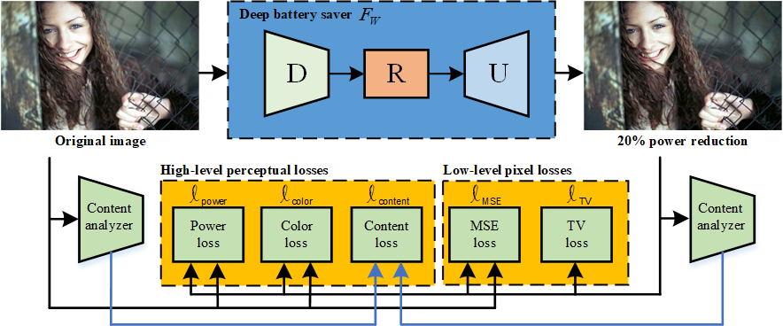

# Deep Battery Saver: End-to-end Learning for Power Constrained Contrast Enhancement
Implementation for Deep battery saver, sumbitted to IEEE Transactions on Multimedia(under review).

## Introduction
In this repository, we provide
* Our model architecture description (Deep battery saver)
* Demo code

## Architecture



Please refer to our paper for details.

## Dependencies
* Python 3
* [Tensorflow >= 1.14.0](https://www.tensorflow.org/) (CUDA version >= 10.0 if installing with CUDA. [More details](https://www.tensorflow.org/install/gpu/))
* Python packages:  `conda DeepBatterySaver -n recreated_env --file requirements.txt`

Our code is tested under Windows 10 environment with GeForce GTX 1060 GPU (6GB VRAM). Might work under others, but didn't get to test any other OSs just yet.

## Test models
1. Clone this github repo. 
```
git clone https://github.com/bigmms/deep_battery_saver
cd deep_battery_saver
```
2. Place your testing images in `./Images` folder. (There are several sample images there).
3. Run test. We provide the demo code and you can config in the `agent_test.py`. 
```
# To run with different models, set -model_path as your model path.
# To run for different testing dataset, you need to set -data_dir as your data path.

cd $makeReposit/reinforcement_learning_hdr

# Test model
python agent_test.py --model_path ./checkpoints/test_run.ckpt-700 --data_dir ./test/Images/
```
    

5. The results are in `./test/test_run/results` folder.

## Results


