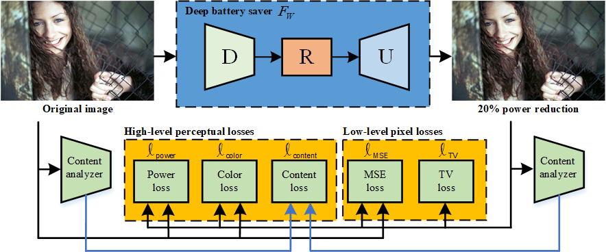

# Deep Battery Saver: End-to-end Learning for Power Constrained Contrast Enhancement



The details about our deep battery saver can be found in our [paper](https://ieeexplore.ieee.org/document/9089316).

## Citation:
If you find our work useful in your research or publications, please consider citing:

    @ARTICLE{yin_tmm20_pcce,  
    author={J. {Yin} and B. {Chen} and Y. {Peng} and C. {Tsai}},  
    journal={IEEE Transactions on Multimedia},   
    title={Deep Battery Saver: End-to-end Learning for Power Constrained Contrast Enhancement},   
    year={2020},  
    volume={},  
    number={},  
    pages={1-1},}
    
## Dependencies
* Python 3
* Anaconda 3
* [Tensorflow >= 2.0.0](https://www.tensorflow.org/) (CUDA version >= 10.0 if installing with CUDA. [More details](https://www.tensorflow.org/install/gpu/))
* Python packages: You can install the required libraries by the command `conda DeepBatterySaver -n recreated_env --file requirements.txt`. We checked this code on cuda-10.0 and cudnn-7.6.5.

## It was tested and runs under the following OSs:
* Windows 10
* Ubuntu 16.04/18.04

Might work under others, but didn't get to test any other OSs just yet.

## Usage
1. Clone this github repo. 
```
git clone https://github.com/bigmms/deep_battery_saver
```
2. Place your testing images in `./test` folder. (There are several sample images).
3. Then, `cd` to `deep_battery_saver` and run following command for evaluation:
```
python main.py --source_path ./test/pills.jpg
```
4. To run with different settings, add --num_epochs, --power_level, --learning_rate, --source_path, --target_path as you need.
5. The results are in `./results` folder.

## Results


